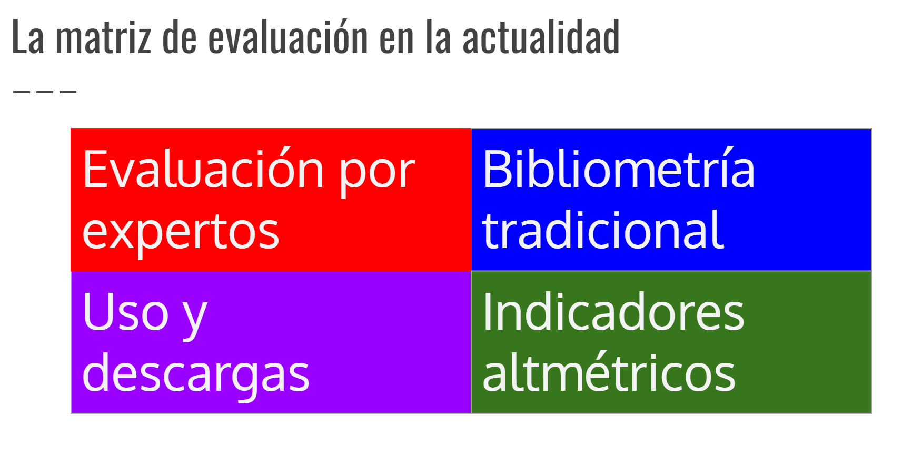

# Introducción general al curso{#intro}

**IN PROGRESS**

Este capítulo haremos un pequeño recorrido desde la bibliometría tradicional hasta las denominadas _altmetrics_ o altmétricas, una batería de indicadores en pleno desarrollo teórico y metodológico, caracterizadas por su naturaleza digital, reflejo de las transformaciones que ha sufrido la comunicación científica en las últimas décadas, como resultado de su traslación a la red.

Revisaremos su aparición y propuesta inicial, así como su evolución a lo largo de los años. Finalmente discutiremos las implicaciones que ha tenido para el desarrollo de la bibliometría así como las limitaciones conceptuales y técnicas a las que se enfrenta hoy día.
asdfadf
## De las citas a las altmétricas

La bibliometría tradicional, basada en la publicación científica en revistas académicas y la medición de su impacto a través de la citación, comenzó su desarrollo en los años 60 y 70, siguiendo los pasos de sus precursores, Eugene Garfield, Robert Merton y Derek de Solla Price.

Ellos son los encargados de establecer los cimientos de una disciplina que transformará el modo en que la investigación es gestionada y evaluada. Sus principales aportaciones son las siguientes:

1. La creación de los llamados índices de citas [@garfieldScienceCitationIndex1964], hoy accesibles a través de bases de datos como Web of Science, Scopus o Google Scholar.

2. La conceptualización de la cita como medida de reconocimiento y prestigio social en la academica [@mertonMatthewEffectScience1968].

3. La construcción de los cimientos matemáticos que permiten modelar la forma de producción y citación del conocimiento científico de manera cuantitativa [@priceGeneralTheoryBibliometric1976].

Esta disciplina ha ido creciendo especialmente en la segunda parte del siglo XX, como una especialidad instrumental al servicio de la evaluación y gestión política de la ciencia. Sin embargo, el nuevo contexto tecnológico con el auge de las redes sociales, el desarrollo de infrastructuras digitales y abiertas para acelerar la comunicación científica (e.g., repositorios, bancos de datos), han transformado el proceso de comunicación científica. La generación de nuevos medios de comunicación como son las redes sociales o los repositorios, abre la puerta al desarrollo de nuevos indicadores cuantitativos.

### El Almetric Manifesto {-}

Toda esta nueva generación de métricas de la ciencia en red, se cristalizan en el Manifiesto Altmetrics (@priemAltmetricsManifestoAltmetrics2010), enunciado por Jason Priem entre otros autores y que culmina un proceso de maduración de nuevas propuestas presentadas como alternativas a las citas, como son los indicadores de uso o descargas (@kurtzUsageBibliometrics2011,@torres-salinasTendenciasMapasCiencia2014) o la Webmetría o Cibermetría (@orduna-maleaCibermetriaMidiendoEspacio2015;@thelwallHistoryWebometrics2012.

Este documento presenta por primera vez las altmétricas como una batería de indicadores alternativos a la citación, caracterizados por ser nativos digitales. El manifiesto denuncia la imposibilidad actual de los científicos de mantenerse al día debido al crecimiento exponencial de las publicaciones, e indica que esta velocidad hace que incluso los indicadores basados en citas sean excesivamente lentos a la hora de captar trabajos potencialmente interesantes. Esto les hace proponer los indicadores basados en menciones en redes sociales como una alternativa rápida y más eficaz.

Además, no se limitan a criticar las citas como medida de impacto, sino que también considera la inclusión de nuevos formatos de publicación, más allá del artículo de revista:

>Altmetrics expand our view of what impact looks like, but also of what’s making the impact. […] Unlike citation metrics, altmetrics will track impact outside the academy, impact of influential but uncited work, and impact from sources that aren’t peer-reviewed. […] The speed of altmetrics presents the opportunity to create real-time recommendation and collaborative filtering systems

## ¿Qué entendemos por altmetrics?

Las altmétricas son consideradas una forma alternativa de
medir el impacto de los resultados académicos de la investigación a través de la red social y están destinadas a mejorar y complementar las formas más tradicionales de evaluación mediante citas (@priemAltmetricsManifestoAltmetrics2010). Su nombre tiene su origen en un tuit (@priemTermArticlelevelmetricsIt2010), y aunque suelen confundirse con las denominadas _article-level metrics_ (@neylonArticleLevelMetricsEvolution2009), tienen que ver con la  difusión y visibilidad de la investigación en plataformas sociales, desde la búsqueda social de bibliografía a través de Facebook, a la discusión de resultados vía Twitter e incluyendo cualquier impacto que una publicación o autor pueda tener en la web social (@bar-ilanCitationsScholarsVisibility2012).

```{r matriz-eval, echo=FALSE, out.width="100%", fig.cap="Matriz de evaluación"}

```

Si clasificamos las aproximaciones metodológica que se utilizan en la evaluación en cuatro tipos (figura \@ref(fig:matriz-eval), podríamos decir que las altmétricas y los indicadores de uso y descargas representan un cambio de paradigma, al situar el foco de atención en el impacto o la repercusión que tienen los trabajos académicos fuera del entorno académico. 


## Indicadores y taxonomías

## Relación entre citas y las altmétricas

## Limitaciones conceptuales de las altmétricas

## Limitaciones técnicas de las altmétricas


Figures and tables with captions will be placed in `figure` and `table` environments, respectively.

```{r nice-fig1, fig.cap='Here is a nice figure!', out.width='80%', fig.asp=.75, fig.align='center'}
par(mar = c(4, 4, .1, .1))
plot(pressure, type = 'b', pch = 19)
```

Reference a figure by its code chunk label with the `fig:` prefix, e.g., see Figure \@ref(fig:nice-fig1). Similarly, you can reference tables generated from `knitr::kable()`, e.g., see Table \@ref(tab:nice-tab).

```{r nice-tab, tidy=FALSE}
knitr::kable(
  head(iris, 20), caption = 'Here is a nice table!',
  booktabs = TRUE
)
```

