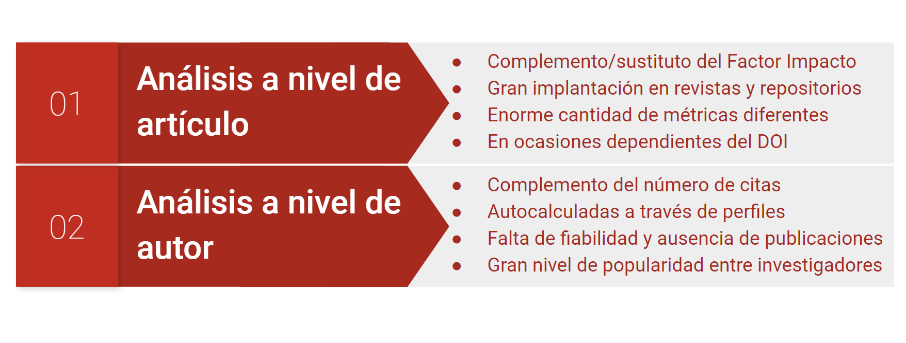
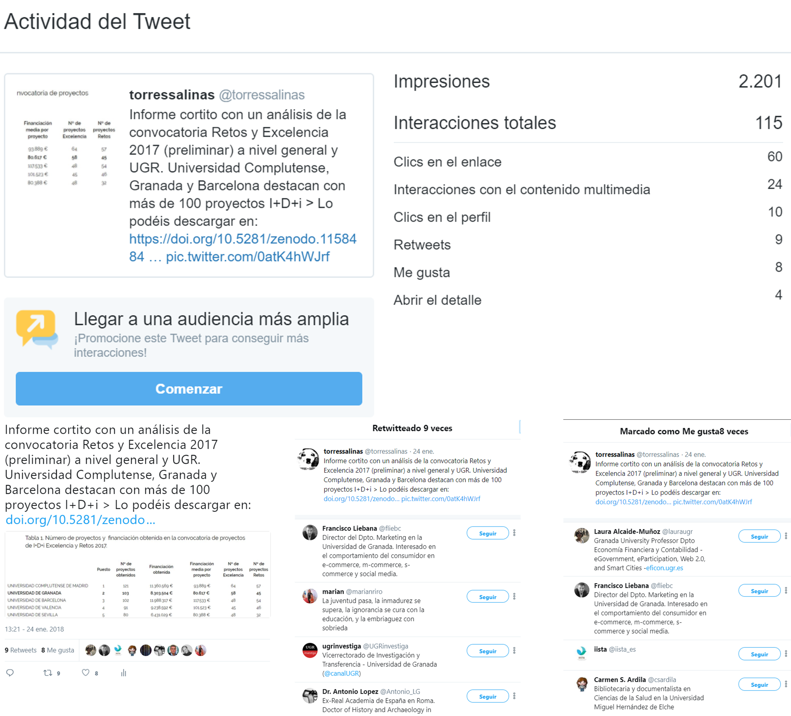
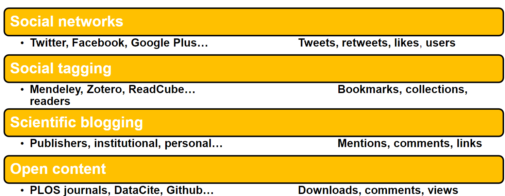
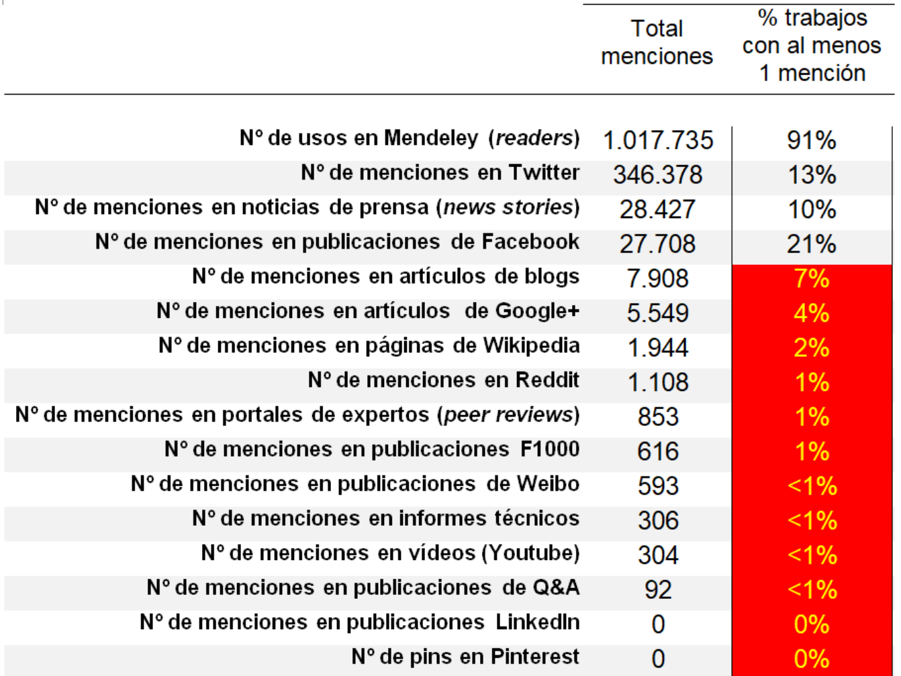
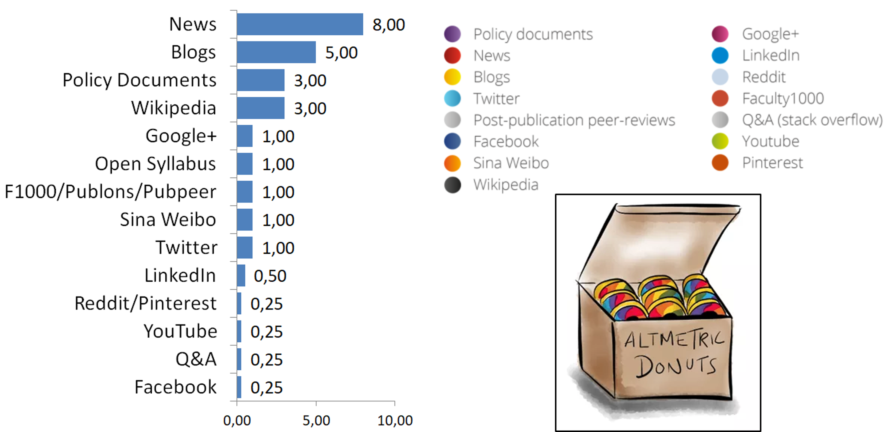

# Herramientas y fuentes altmétricas {#sesion2}

{width=100%}
En esta sesión vamos analizar desde el punto de vista técnico y metodológico cómo funcionan las altmétricas, cómo se identifican las menciones, el procesamiento de datos, las diferentes fuentes desde las que podemos extraer estos datos y cómo podemos plantear un estudio científico a partir de estos indicadores.

## Tipos de análisis

Si seguimos el esquema clásico de la bibliometría, existen tres tipos de análisis según el nivel de agregación que empleemos de la unidad de análisis:

1. **Nivel macro**. Referido a estudios que analizan un gran volumen de datos de manera agregada. Estos análisis bibliométricos pueden ofrecer resultados de manera robusta estadísticamente hablando. _Ejemplos_: análisis de países o de grandes áreas científicas.

2. **Nivel meso**. Tiene que ver con análisis de unidades de agregación intermedias, donde los estudios aún muestran resultados bastante robustos y permiten entrar en mayor detalle para explicar los mecanismos detrás de un fenómeno. _Ejemplos_: análisis de universidades, departamentos, disciplinas.

3. **Nivel micro**. Donde el objeto de estudio es el individuo o el paper. Requieren una gran contextualización y suelen tener un carácter descriptivo o exploratorio.

Los indicadores altmétricos se introdujeron con la promesa de facilitar los análisis micro, con muchos autores referiéndose a los mismos como Article-level metrics [@neylonArticleLevelMetricsEvolution2009] o Author-level metrics [@orduna-maleaBibliometriaQueViene2016;@torres-salinasPresenciaRedesSociales2014].

{width=100%}

Algunos ejemplos en diferentes niveles:

- Altmétricas a nivel revista - [PLOS One](https://journals.plos.org/plosone/)
- Altmétricas a nivel de autor - [ImpactStory](https://profiles.impactstory.org/) - [UGR Investiga](http://investigacion.ugr.es/ugrinvestiga/static/BuscadorRankingRrss/*/buscar
)
- Integración en revistas [Research Evaluation](https://academic.oup.com/rev/?login=true)
- Integración en repositorios [bioRxiv](https://www.biorxiv.org/content/10.1101/2020.07.01.181669v2)

Del mismo modo podemos ver en mayor detalle la información que ofrece Altmetric.com, uno de los principales agregadores altmétricos como veremos más adelante. Esta herramienta ha estado publicando hasta 2020 un listado con [los top 100 trabajos con más altmétricas](https://www.altmetric.com/top100/home/).

{width=100%}

## Fuentes primarias

Aunque cada vez es menos habitual, gracias a la gran expansión que han tenido los agregadores altmétricos, siempre es posible sacar indicadores de las diferentes fuentes sociales de manera dirigida y específica. Asimismo hay indicadores específicos de cada fuente que muchas veces no se pueden extraer directamente de estos agregadores.

{width=100%}

Cuestiones importantes a recordar:

- Cada plataforma nos puede ofrecer más de un indicador
- Hay que distinguir entre generalistas y académicas
- Los datos altmétricos se recogen ítem a ítem
- Requieren procesamiento y normalización, coste en tiempo
- Se gana en precisión en los indicadores
- Posibilidad de calcular métricas avanzadas (ARS)

{width=100%}

A pesar de las grandes oportunidades que _en teoría_ nos ofrecen las altmétricas en cuanto a cantidad y diversidad de indicadores, lo cierto es que en muchos casos pueden resultar inútiles, ya que **muchas de ellas apenas son capaces de capturar actividad académica**. En esta tabla podemos observar cómo son pocas fuentes las que aglutinan el mayor número de menciones:

{width=100%}

### ¿Cómo se identifican las menciones en redes sociales? {-}

Los procesos de búsqueda en las fuentes primarias suelen ser complejos, la dificultad dependerá de la fuente, pero al menos habrá que buscar:

- DOI / página web de la revista
- Título completo del trabajo
- Referencias al trabajo desde terceros 
- Diferentes versiones del trabajo (preprint,etc…)

Con todo, nunca tendremos la certeza de recuperar las métricas relacionadas por ejemplo con artículo.

Vamos a ver algunos ejemplos de utilización de una fuente primaria para obtener altmétricas:

- [Twitter](https://twitter.com/nrobinsongarcia)
- Cómo se unen las diferentes versiones de un mismo documento - [Arxiv](https://arxiv.org/search/?query=robinson-garcia&searchtype=author&source=header)

Para poder descargar tanto de estas fuentes como de otras los datos, *es esencial manejarse en el mundo de las APIs*. Algunos paquetes en R:

- [rtweet](https://docs.ropensci.org/rtweet/)
- [wikitaxa](https://docs.ropensci.org/wikitaxa/)

**Para más información sobre el manejo de APIs os recomiendo [este recurso](https://github.com/Wences91/Fuentes_de_informacion/wiki/APIs)**.

## Fuentes secundarias: Agregadores de altmétricas

Hay tres plataformas de altmétricas que debes conocer. Estas son:

- [Altmetric](http://altmetric.com) - [Video tour](https://drive.google.com/file/d/1a1niqyUrgQt2j2T0KSTlXCV7wgg0JWkd/view?usp=sharing)
- [PlumX](https://plumanalytics.com/). Integrado en Scopus
- [ImpactStory](https://profiles.impactstory.org/) - [Video tour](https://drive.google.com/file/d/1_waYodcH30L6SLt21K4E5duymifAt4WW/view?usp=sharing)

### ¿Cómo trabajan estas fuentes? {-}

1. **Publicación científica**. Se produce la publicación de un producto / output científico (artículo, dataset, working paper)
2. **Búsqueda de identificadores**. La plataforma busca todos los identificadores con los que cuenta la publicación (URL web de la revista, DOI, PMID, arXiv ID, DOI, ORCID).
3. **Recuperación de menciones**. Estos identificadores se lanzan contras las diferentes fuentes primarias y se recuperan todas las menciones disponibles sobre la publicación científica.

{width=100%}

## Redes académicas

Precauciones a la hora de utilizar redes académicas:

- No utilizar nunca para labores de evaluación científica y toma de decisiones (asignación plazas, recursos económicos, proyecto etc…) sin contar con el CV real del investigador a fin de comprobar si están todas las publicaciones. 
- Ser escépticos con los indicadores que proponen algunas redes/perfiles, por ejemplo el indicador i-10 de Google Scholar, el ResearchGate Score… 

A continuación veamos tres redes y sus características que representan tres modelos diferentes de perfiles métricos:

- [Google Scholar Citations](http://scholar.google.com)
- [ResearchGate](https://www.researchgate.net/)
