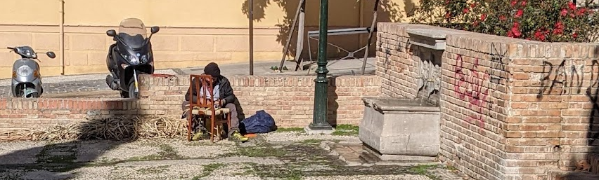

# Evaluación final {-}

{width=100%}

La práctica final de la asignatura consistirá en la confección de un pequeño análisis altmétrico de hasta cinco páginas. Las instrucciones así como el enlace a los datos necesarios para poder llevarlo a cabo están disponibles en el siguiente documento

**
[INSTRUCCIONES PARA LAS PRÁCTICAS](https://docs.google.com/document/d/1Fy4l_upMGamD8YEpiVR72THR8kxsLsFKAlv-h9lza-M/edit?usp=sharing)
**

