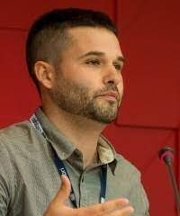

--- 
title: "Nuevas métricas de la ciencia en red"
author: "Daniel Torres-Salinas y Nicolas Robinson-Garcia"
date: "`r Sys.Date()`"
knit: 'bookdown::render_book'
documentclass: book
site: bookdown::bookdown_site
output: bookdown::gitbook
bibliography: [references.bib, packages.bib]
biblio-style: 'apalike'
link-citations: yes
description: "Manual relacionado con la asignatura 'Nuevas métircas de la ciencia en red, dentro del Máster en Información Científica de la Universidad de Granada."
url: 'https://elrobin.github.io/nuevas_metricas'
---

# Bienvenidos {-}

{width=100%}

En los últimos años se han multiplicado las propuestas sobre nuevos indicadores asociados a aplicaciones de la web social, denominados altmetrics (o métricas alternativas) que se unen a las métricas de uso o usage metrics, vinculadas a las descargas y vistas de los documentos. La suma de estos dos conjuntos han generado un conjunto de métricas que nos permiten analizar, cuantificar la comunicación desde un prisma diferentes. Estos indicadores nos permiten en la actualidad plantear una forma alternativa de evaluar la información científica permitiéndonos comprender mejor los procesos de generación, difusión y diseminación de los documentos científicos y, por tanto, de la comunicación científica en internet en su conjunto

Esta asignatura está enmarcada dentro del [Máster en Información y Comunicación Científica](https://masteres.ugr.es/informacion-comunicacion-cientifica/) de la [Universidad de Granada](https:://ugr.es). 

## Los profesores {-}

Daniel Torres-Salinas                                 Mini bio
---------------------                               ------------------------
              Profesor del departamento de Información y Comunicación y director de la Unidad de Evaluación Científica de la Universidad de Granada. Es investigador en el Grupo de Investigación Estudios Cuantitativos de la Comunicación Científica (EC3). [Más info](https://sites.google.com/go.ugr.es/torressalinas)

Nicolas Robinson-Garcia                       Mini bio
---------------------                        ------------------------
    Profesor del departamento de Información y Comunicación de la Universidad de Granada e investigador Ramón y Cajal. Es investigador en el Grupo de Investigación Estudios Cuantitativos de la Comunicación Científica (EC3). [Más info](https://nrobinsongarcia.com)

## Objetivos de la asignatura {-}

- Introducir al alumno a las diversas posibilidades de comunicación social de la ciencia y la tecnología a través de Internet y plataformas digitales y,

- formar a los alumnos en las métricas y métodos de evaluación científica surgidos en torno a las nuevas plataformas de comunicación científica

Para más información consulta la [guía docente de la asignatura](https://masteres.ugr.es/informacion-comunicacion-cientifica/docencia/plan-estudios/guia-docente/M12/56/1/59)